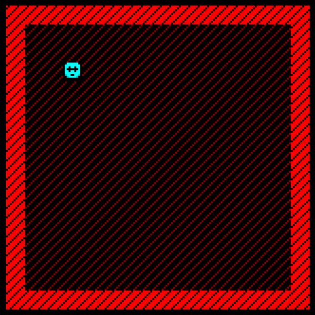
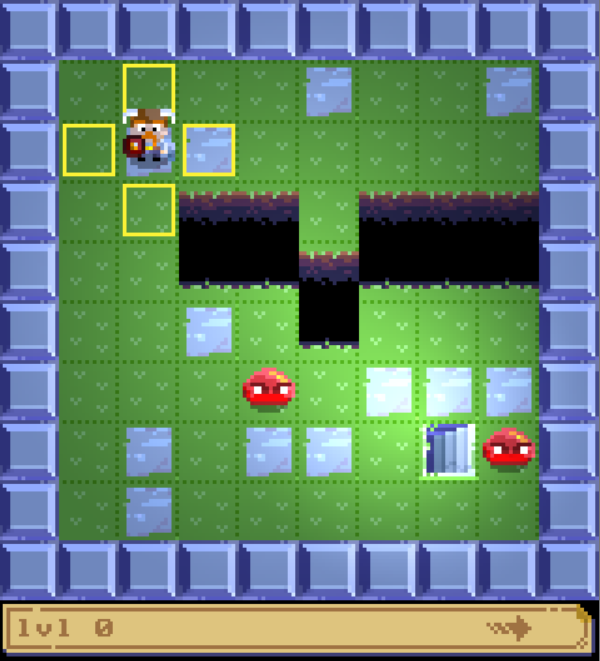
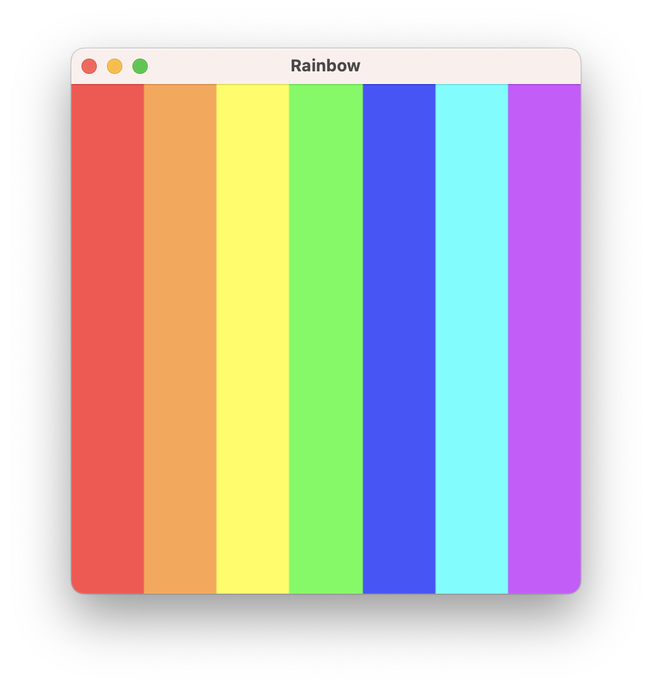

# Loveable Scala Rogues - LSUG - 16th January 2024

First presented Internally at 47 Degrees on 14 December 2023, then on the 16th January 2024 at the London Scala User Group (LSUG), hosted by The Trade Desk.

## Abstract

Tired of shovelling strings of data from one end of the internet to the other?
Want to use Scala to delight and entertain your friends and family?
You should try game development!

...but how does a Scala functional programmer get started making games?

In this talk we will bootstrap you into your next all-consuming hobby. We'll neatly side-step the scary problems of art and game design, and guide you into the fun and challenging coding possibilities of building your first game.

## Slides

The slides can be viewed [here](https://purplekingdomgames.github.io/talks/lovable-scala-rogues/).

## Demos

There are six demo projects associated with the talk in the `lovable-scala-rogues/demos` folder.

Each is an individual [Mill](https://mill-build.com/mill/Intro_to_Mill.html) project, not a multiproject build, because they were all made using the [Indigo G8](https://github.com/PurpleKingdomGames/indigo.g8) project template.

They were made explicitly for the purposes of doing the talk, so code quality may vary.

In order for presentation:

## Let's build a basic Roguelike



This was the live coded demo, where we start with a fairly blank Indigo project, and see how to wire up a simple ASCII-like terminal and render a player character the user can more around a room.

To run, navigate to the directory on your command line.

Run the 'initial' version that displays 'hello, world!', with:

```bash
./mill myroguelike.runGame
```

Run the 'completed' version that displays the moving player character, with:

```bash
./mill myroguelikecomplete.runGame
```

## Hoplike



A very simple roguelike game that is a sort of poor imitation of [Hoplite](http://www.magmafortress.com/p/hoplite.html), but which exhibits the features that the second half of the talk goes into.

To run, navigate to the directory on your command line, and run with:

```bash
./mill hoplike.runGame
```

## State Machine


An example of how you can manage a simple state-machine-like construct in Indigo's version of the Elm architecture.

To run, navigate to the directory on your command line, and run with:

```bash
./mill statemachine.runGame
```

## Basic shader


To run, navigate to the directory on your command line, and run with:

```bash
./mill basic.runGame
```

## Rainbow Shader



To run, navigate to the directory on your command line, and run with:

```bash
./mill rainbow.runGame
```

## Rainbow Scene Shader


To run, navigate to the directory on your command line, and run with:

```bash
./mill rainbow.runGame
```
